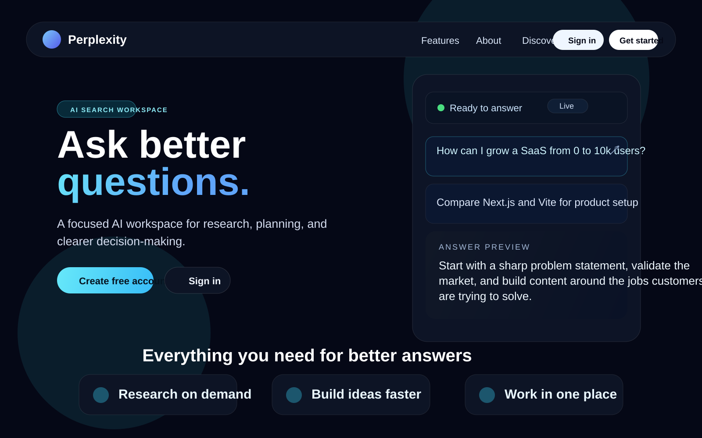
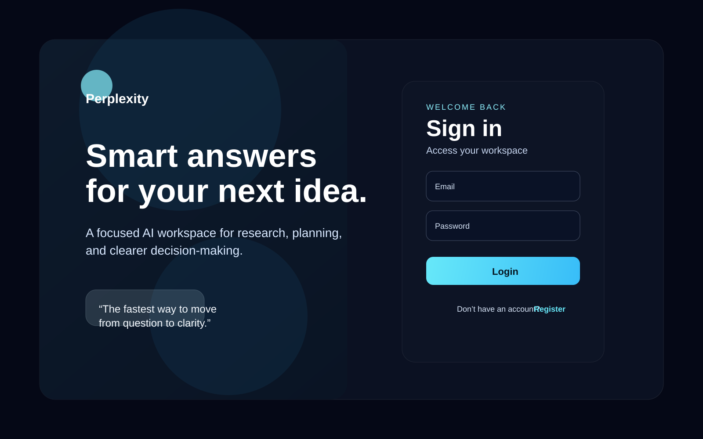
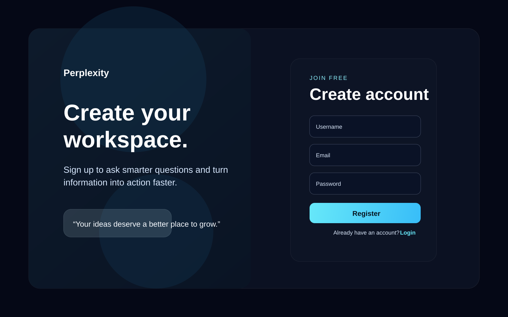
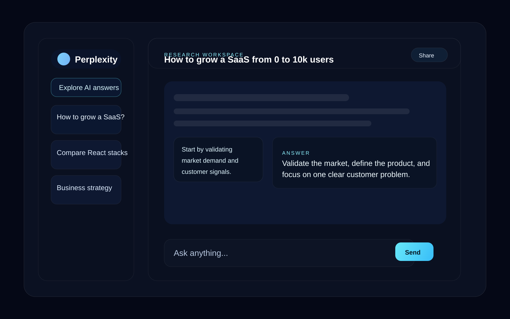

# Perplexity

Perplexity is a modern AI-powered search and chat experience built for fast research, idea exploration, and decision support. The app combines a premium landing experience with secure authentication and an interactive dashboard inspired by AI research assistants.

Live demo: https://perplexity-yvl7.onrender.com

## Overview

Perplexity helps users:
- ask high-quality questions and get concise, useful answers
- explore topics faster with AI-assisted guidance
- organize research in a clean conversation workspace
- continue from a strong onboarding flow with login and registration

## Highlights

- Beautiful landing page with product-focused storytelling
- User register and login flows with friendly UI states
- Protected dashboard access for authenticated users
- AI chat interface designed for production-like user experience
- Responsive layout for desktop and smaller screens
- MongoDB-backed authentication and app data structure

## Tech Stack

- Frontend: React, Vite, Redux Toolkit, Tailwind CSS
- Backend: Node.js, Express, MongoDB, Mongoose, JWT
- Real-time features: Socket.IO
- Email features: Nodemailer
- AI services: Gemini / Mistral / Tavily integrations (depending on setup)

## Project Structure

- Backend/ - Express server, controllers, routes, models, middleware, socket setup
- Frontend/ - React app, Redux slices, pages, hooks, services
- docs/assets/ - preview images for the app pages

## Screenshots

### Home page



### Login page



### Register page



### Dashboard



## Prerequisites

- Node.js 18 or newer
- npm
- MongoDB running locally or in a cloud instance
- API credentials for AI and email services if you want full functionality enabled

## Environment Variables

Create a .env file in the Backend folder with values similar to:

```env
PORT=8000
MONGODB_URI=mongodb://127.0.0.1:27017/perplexity
JWT_SECRET=your_jwt_secret
GEMINI_API_KEY=your_gemini_key
MISTRAL_API_KEY=your_mistral_key
TAVILY_API_KEY=your_tavily_key
GOOGLE_USER=your_email@gmail.com
GOOGLE_CLIENT_ID=your_google_client_id
GOOGLE_CLIENT_SECRET=your_google_client_secret
GOOGLE_REFRESH_TOKEN=your_google_refresh_token
```

## Getting Started

1. Install backend dependencies:

```bash
cd Backend
npm install
```

2. Start the backend server:

```bash
npm run dev
```

3. In a second terminal, install and start the frontend:

```bash
cd Frontend
npm install
npm run dev
```

4. Open the app in the browser:
- Frontend: http://localhost:5173
- Backend: http://localhost:8000

## Notes

- The frontend and backend are designed to run separately.
- Keep all secrets in environment variables and do not commit real credentials.
- The live deployment is available here: https://perplexity-yvl7.onrender.com

## Contributing

Contributions are welcome. If you want to improve the UI, add new features, or improve backend logic, feel free to open a pull request or fork the project.
